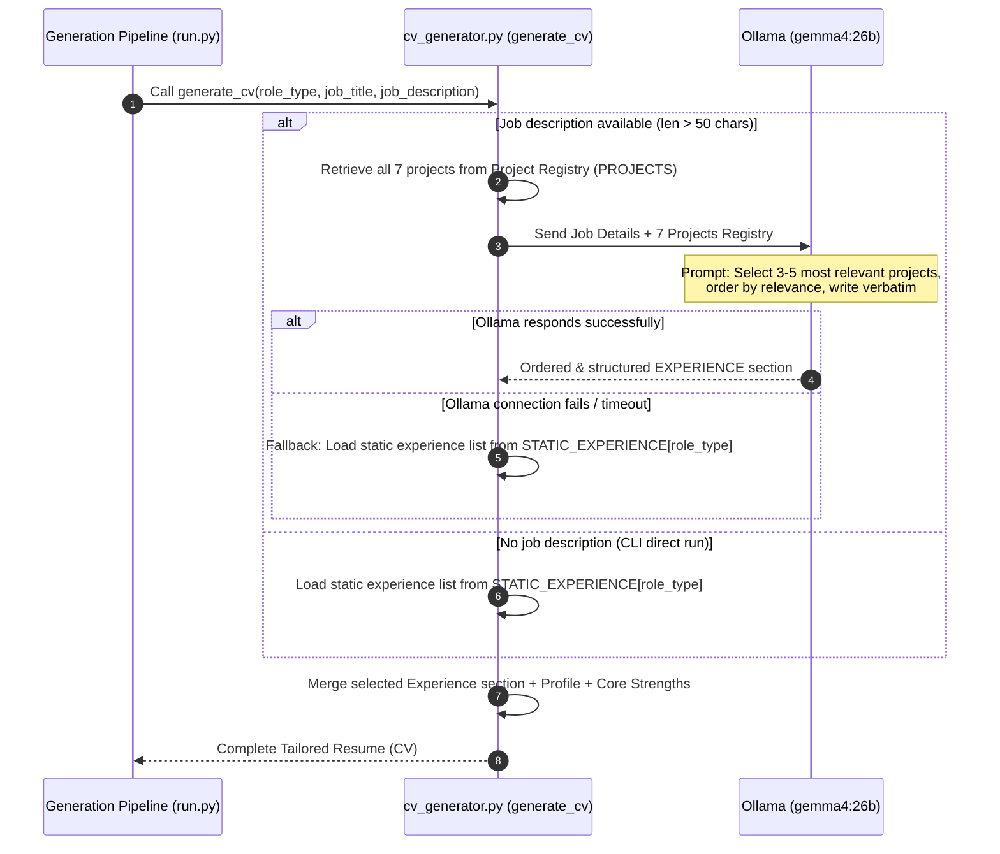

# Job Intelligence System — Architecture Spec

This document describes the system architecture, data flow, staging layer, and dynamic LLM components of the Job-Intelligence-System.

---

## 1. High-Level Architecture

The system is a multi-stage pipeline: **Scrape → Stage (00_saved/) → Analyze → Filter → Match → Generate CV/CL**.
It runs as a local-first service with a **Streamlit UI** on port `8501`, backed by local **Ollama models** (`gemma4:26b`) for cognitive operations.

```mermaid
flowchart TD
    %% ==== Core components ====
    subgraph UI["Streamlit WebUI (app.py)"]
        A1["Search Config / Filters<br/>(config.yaml)"]
        A2["Recent Results & Insights<br/>(re-analyze, metrics)"]
    end

    subgraph Scrapers["Scrapers & Gathering"]
        S1["run.py (Main Runner)"]
        S2["scraper_indeed.py (Indeed)"]
        S3["scraper_linkedin.py (LinkedIn)"]
        S4["scraper_saved.py (Bookmarks)"]
    end

    subgraph Staging["00_saved/ — Raw Staging"]
        ST1["_raw_indeed_*.json"]
        ST2["_raw_linkedin_*.json"]
        ST3["_saved_index.json"]
    end

    subgraph Analysis["Analysis & Alignment"]
        AN1["analyzer.py<br/>(Salary/Level Classification)"]
        AN2["matcher.py<br/>(Scoring & Philosophy Weighting)"]
        OL1["Local Ollama<br/>(gemma4:26b)"]
    end

    subgraph DynamicGen["Dynamic Resume & Cover Letter Generator"]
        CVG["cv_generator.py (Dynamic CV)"]
        CLG["cover_letter_generator.py (Tailored CL)"]
        OL2["Ollama (gemma4:26b)<br/>(Dynamic Experience Sorter)"]
    end

    subgraph Output["10_output/ — Analysis Results"]
        O1["_analyzed.json (All Jobs DB)"]
        O2["00_matches/*_match.md (Match Reports)"]
        O3["10_cvs/*_CV.md (Dynamic Resume)"]
        O4["10_cover-letters/*_CL.md (Cover Letter)"]
        O5["20_pdfs/ (PDF exports)"]
        O6["_debug/ (Playwright screenshots)"]
    end

    %% ==== Data Flow Connections ====
    A1 -->|Read/Write| S1
    S1 -->|Orchestrate| S2
    S1 -->|Orchestrate| S3
    S4 -->|Manual saved| ST3

    S2 -->|Raw dump| ST1
    S3 -->|Raw dump| ST2

    ST1 -->|load_all_from_saved()| AN1
    ST2 -->|load_all_from_saved()| AN1
    ST3 -->|load_saved_from_index()| AN1

    AN1 <-->|Skill/salary extraction| OL1
    AN1 -->|Enriched Data| AN2
    AN2 -->|Save Match Details| O2

    %% ==== Generation Pipeline ====
    O2 -->|Job Details + Role Type| CVG
    O2 -->|Job Details + Role Type| CLG

    CVG <-->|Rank 7 projects based on job description| OL2
    CVG -->|Generate CV| O3
    CLG -->|Generate Cover Letter| O4

    classDef ui fill:#e3f2fd,stroke:#1565c0,stroke-width:2px;
    classDef scr fill:#fff3e0,stroke:#e65100,stroke-width:2px;
    classDef stg fill:#fce4ec,stroke:#c62828,stroke-width:2px;
    classDef ana fill:#efebe9,stroke:#4e342e,stroke-width:2px;
    classDef gen fill:#e8f5e9,stroke:#2e7d32,stroke-width:2px;
    classDef out fill:#f3e5f5,stroke:#4a148c,stroke-width:2px;

    class UI,A1,A2 ui;
    class Scrapers,S1,S2,S3,S4 scr;
    class Staging,ST1,ST2,ST3 stg;
    class Analysis,AN1,AN2,OL1 ana;
    class DynamicGen,CVG,CLG,OL2 gen;
    class Output,O1,O2,O3,O4,O5,O6 out;
```

---

## 2. Three Pipeline Modes

The system has three entry points, all orchestrated by `run.py`:

| Mode | Command | Flow | Use Case |
|------|---------|------|----------|
| **Full scrape** | `run.py --site all` | scrape → `00_saved/` → analyze → `10_output/` | Nightly cron |
| **Staging reanalyze** | `run.py --from-saved` | `00_saved/` → analyze → `10_output/` | Rerun after matcher/config changes |
| **Manual saved** | `run.py --saved` | `scraper_saved.py` → `00_saved/` → merge → analyze → `10_output/` | Process LinkedIn bookmarks |

### Staging Layer (`00_saved/`)

All raw scraped data lands in `00_saved/` before analysis. This decouples gathering from processing:

- `_raw_indeed_{date}.json` — Indeed raw listings (from `scraper_indeed.py`)
- `_raw_linkedin_{date}.json` — LinkedIn search results (from `scraper_linkedin.py`)
- `_saved_index.json` — Manual bookmarks (from `scraper_saved.py`)

Functions in `run.py`:
- `save_raw_to_saved(jobs, source)` — writer (called by scrapers)
- `load_saved_from_index()` — reads `_saved_index.json` only
- `load_all_from_saved()` — reads all three sources, merges into one list

### Output Layer (`10_output/`)

Numeric prefixes enforce semantic ordering:

| Directory | Contents |
|-----------|----------|
| `00_matches/` | Match reports as `.md` with YAML frontmatter |
| `10_cvs/` | Tailored CVs (one per match ≥ threshold) |
| `10_cover-letters/` | Tailored cover letters |
| `20_pdfs/` | PDF exports (per-company subdirectories) |
| `_debug/` | Playwright debug screenshots |
| `_analyzed.json` | Full analyzed job data |
| `_analyzed_full.json` | Full data with LLM context scores |

### Frontmatter Schema

Every match report carries these fields (Dataview-queryable in Obsidian):

| Field | Example | Purpose |
|-------|---------|---------|
| `source` | `indeed` / `linkedin` / `manual` | Origin platform |
| `type` | `auto` / `manual` | Capture method |
| `saved_at` | `2026-07-11` | Date added to system |
| `match_score_pct` | 0–100 | Overall match score |
| `tier` | `Strong` / `Good` / `Partial` / `Weak` | Tier label |
| `skills_score` | 0–100 | Skill embedding similarity |
| `experience_score` | 0–100 | Seniority level |
| `location_score` | 0–100 | City + remote match |
| `salary_score` | 0–100 | Salary vs minimum |
| `context_score` | 0–100 | Brand/ethos alignment (LLM) |
| `company` | `"Example Corp"` | Company name |
| `title` | `"Creative Technologist"` | Job title |
| `location` | `"Edinburgh"` | Job location |
| `url` | `"https://..."` | Original listing URL |

---

## 3. Dynamic Experience Generator (Ollama Pipeline)

This section highlights how CVs are dynamically tailored for each specific job posting using the local `gemma4:26b` model.



---

## 4. Project Registry & Role Mappings

Projects are declared as modular data fragments in `cv_generator.py` under the `PROJECTS` registry.

| Project ID | Project Title | Key Focus | Primary Target Roles |
|------------|---------------|-----------|----------------------|
| `portfolio_website` | Portfolio Website Design & Development | HTML/CSS/JS, Sanity CMS, AI-assisted dev | `web_developer`, `creative_technologist` |
| `independent_development` | Independent Dev & Workflow Support | Python, PostgreSQL, Selenium, Web Scraping | `development_support`, `data_analysis`, `web_developer` |
| `linux_systems` | Linux Systems & Process Management | Linux, Ubuntu, tmux, process monitoring | `development_support`, `web_developer` |
| `terra_drone` | Sales & Cross-functional Support | Communication, technical brochures, sales | `general`, `development_support` |
| `feral` | Creative Workflow — "Feral" | Obsidian Canvas, ComfyUI, Stable Diffusion, local LLMs | `creative_technologist`, `technical_artist` |
| `arch_viz` | Architectural Visualization | Blender, ComfyUI, Obsidian | `creative_technologist`, `technical_artist` |
| `hive_floral_pod` | Design Competition — "Hive Floral Pod" | Procreate, Blender, 3D visual proposal | `creative_technologist`, `technical_artist` |

### Static Mapping Fallbacks (Ollama Offline)

| Role | Project Order |
|------|---------------|
| `web_developer` | Portfolio Website → Independent Dev → Linux Systems |
| `development_support` | Independent Dev → Linux Systems → Terra Drone |
| `data_analysis` | Independent Dev → Terra Drone |
| `creative_technologist` | Feral → Arch Viz → Hive Floral Pod → Portfolio Website |
| `technical_artist` | Feral → Arch Viz → Hive Floral Pod |
| `general` | All projects in standard chronological order |

---

## 5. Key Design Decisions

### Why a Staging Layer?

1. **Decouple scrape from analyze** — If the matcher changes, `--from-saved` reprocesses cached raw data without re-scraping (avoids rate limits)
2. **Raw data preservation** — `_raw_indeed_*.json` lets you debug parser changes or re-run with different analyzer versions
3. **Merge manual + auto** — Bookmarks from `scraper_saved.py` join the same pipeline as scraped listings, deduplicated by URL

### Why Numeric Prefixes?

`00_` = raw/staging, `10_` = analysis, `20_` = final artifacts. Alphabetical sort becomes semantic sort — no need to remember directory names.

### Why Frontmatter + Dataview?

Structured YAML in `.md` files means:
- No separate database — Obsidian's FTS + Dataview is the query layer
- Human-readable without tooling
- Cross-linkable with other vault notes
