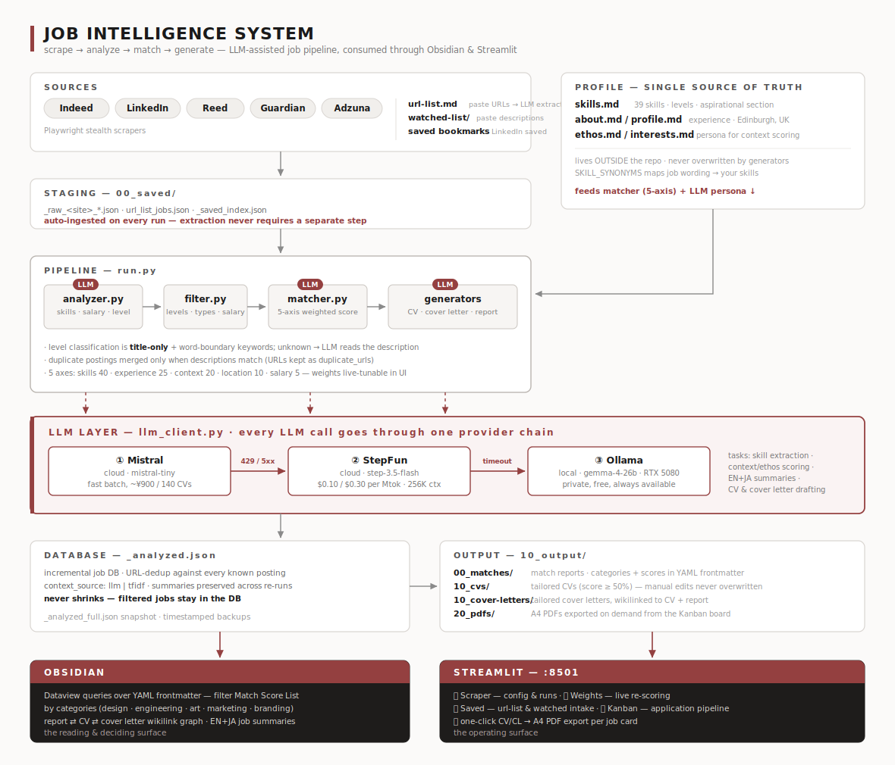

# AI Job Scout System

**An end-to-end job search pipeline** — scrape hundreds of listings, score them against your profile with an LLM, and auto-generate tailored CVs and cover letters for every match. Cheap cloud models do the heavy batches; a local Ollama model is always there as the final fallback.

```python
# One command runs the full pipeline
python run.py --site all

# → Scrape  → Save to 00_saved/ staging → Analyze → Match → Generate CV/CL
#    500+ jobs   stored as raw JSON          LLM      5-axis   tailored per job

# Re-analyze from staging only (skip scraping, use cached raw data)
python run.py --from-saved

# Manual saved jobs (LinkedIn bookmarks + Indeed saved)
python run.py --saved
```

---

## Why This Exists

Job hunting is a numbers game, but manual tailoring doesn't scale. This pipeline:

1. **Scrapes** five sites — Indeed UK, LinkedIn, Reed, Guardian Jobs, Adzuna — plus manual intake (`url-list.md`, watched-list, saved bookmarks)
2. **Analyzes** each job with an LLM — salary parsing, skill extraction, title-only seniority classification
3. **Matches** each job against your profile using 5-axis weighted scoring (skills, experience, location, salary, context/ethos)
4. **Generates** a tailored CV and cover letter for every job scoring ≥ 50%
5. **Outputs** Obsidian-ready Markdown with YAML frontmatter (incl. `categories`) — queryable via Dataview, operated via a Streamlit UI

All LLM calls go through one provider chain — **Mistral (cloud, primary) → StepFun step-3.5-flash (cloud, fallback) → Ollama Gemma-4 (local, last resort on an RTX 5080)** — so batches are fast and cheap, and the pipeline keeps working offline. Job text and your persona are sent to the cloud providers; switch `ANALYSIS_PROVIDER=ollama` for a fully local run. See [2-Tier LLM Strategy](#2-tier-llm-strategy) below.

---

## Architecture



**Flow in one line:** five Playwright scrapers + manual intake → `00_saved/` staging (auto-ingested every run) → `run.py` pipeline (`analyzer` → `filter` → `matcher` → generators) → `_analyzed.json` incremental DB → `10_output/` Markdown → read in **Obsidian**, operated from **Streamlit** — then an **LLM review dialogue** (annotate findings in Obsidian, LLM replies, apply agreed fixes per-fix to the document or back to the reusable masters), and a **nightly Hermes cron** that runs the whole pipeline unattended and Telegram-notifies only new high matches. Details: [ARCHITECTURE.md](ARCHITECTURE.md) §6–7.

CV headers (title + tagline) are **per-role**: each `career/cv/profile/<role>.md` carries `role_title` / `role_tagline` frontmatter that `cv_generator.py` injects, so a Product Designer application leads with a different identity than a Creative Technologist one.

Every LLM task (skill extraction, context/ethos scoring, EN+JA summaries, CV & cover-letter drafting) goes through `llm_client.py`, which walks the provider chain **Mistral → StepFun → local Ollama** on rate limits, 5xx errors, timeouts, or missing API keys.

---

## Match Scoring

Each job is scored on five weighted axes:

| Axis         | Default Weight | Method                                           |
| ------------ | --------------- | ------------------------------------------------ |
| **Skills**   | 40%             | Word-boundary keyword + synonym mapping + TF-IDF name similarity |
| **Experience** | 25%           | Seniority level matching (entry/mid/senior/director) |
| **Location** | 10%             | City match + remote-friendliness bonus            |
| **Salary**   | 5%              | Salary range vs. minimum expectation              |
| **Context**  | 20%             | Brand & ethos alignment (profile, ethos, about) via TF-IDF max-similarity |

Weights are **adjustable in real-time** via the Streamlit UI — no code changes needed.

### Tier System

| Tier | Score Range | Icon | CV/CL Generated? |
| ---- | ----------- | ---- | ---------------- |
| Strong | 80%+ | 🟢 | ✅ Yes |
| Good | 60–79% | 🟡 | ✅ Yes |
| Partial | 40–59% | 🟠 | ✅ If ≥ 50% threshold |
| Weak | < 40% | 🔴 | ❌ No |

### Sample Match Report

```markdown
---
match_score: 0.72
match_score_pct: 72
tier: "Good"
company: "Example Corp"
title: "Creative Technologist"
location: "Edinburgh"
source: "indeed"                    ← 取得元: indeed / linkedin / manual
type: "auto"                        ← auto / manual
saved_at: 2026-07-11                ← 取得日（scraped_at の日付部分）
skills_score: 0.81
experience_score: 0.75
location_score: 1.00
salary_score: 0.45
context_score: 0.60
url: "https://indeed.com/..."
---

# Match Report: Creative Technologist — Example Corp

**Score: 72%  🟡 Good**

## 📊 Breakdown
| Category | Score | Weight |
|----------|-------|--------|
| Skills   | 81%   | 40%    |
| ...

## 📎 Related Documents
- **CV:** [ExampleCorp_Creative_Technologist_CV](../10_cvs/ExampleCorp_Creative_Technologist_CV.md)
- **Cover Letter:** [link](../10_cover-letters/ExampleCorp_Creative_Technologist_CL.md)
```

---

## Streamlit UI

Five tabs in a single app (`app.py`):

| Tab | Function |
| --- | -------- |
| **🔍 Scraper** | Edit keywords/locations/salary/sites, run scraper, view results table |
| **🎯 Weights** | Drag sliders to adjust scoring weights, regenerate all match reports live |
| **👁 Saved** | url-list.md & watched-list intake — paste URLs or descriptions, extract & analyze |
| **🧐 Review** | Batch-review CVs/CLs, annotation dialogue (💬 追記に回答), per-fix apply with destination choice (この文書のみ / 元ファイル+この文書 / 適用しない) |
| **📄 PDF** | Jobs ranked by score, per-document **CV/CL → versioned A4 PDF export** |

⚠️ Streamlit auto-reloads `app.py` on save, but **not** imported modules — after editing `reviewer.py`, `cv_generator.py`, etc., restart the server.

```bash
# Launch
cd career/Job-Intelligence-System
streamlit run app.py --server.port 8501 --server.address 0.0.0.0 --server.headless true
```

---

## Tech Stack

| Layer | Technology | Why |
| ----- | ---------- | --- |
| Scraping | Playwright + stealth | Anti-bot evasion, headless browsing |
| LLM calls | `llm_client.py` chain: Mistral → StepFun → Ollama (Gemma-4-26b local) | Cheap fast batches, offline-safe fallback |
| Skill Matching | Word-boundary keywords + `SKILL_SYNONYMS` + TF-IDF (scikit-learn) | Deterministic, tunable, no model download |
| Scoring | Custom weighted engine | 5-axis, adjustable via UI |
| CV/CL Generation | Same LLM chain | Tailored per job, no templates |
| PDF Export | weasyprint + markdown | One-click A4 from the Kanban board |
| UI | Streamlit | Lightweight, 1-file, no build step |
| Output | Obsidian Markdown + Dataview | Queryable knowledge base (`categories`, scores in frontmatter) |
| Scheduling | Cron | Nightly scrape + reanalyze |

---

## Quick Start

```bash
# 1. Install Python dependencies
pip install -r requirements.txt
playwright install chromium

# 2. Configure LLM providers in .env (any subset works; the chain skips missing keys)
#    MISTRAL_API_KEY=...          primary (cloud)
#    STEPFUN_API_KEY=...          fallback (cloud)
#    FALLBACK_PROVIDERS=stepfun,ollama
#    Local last resort: install Ollama and pull the model set in OLLAMA_MODEL
#    (default: gemma-4-26b-a4b-it-gguf)

# 3. Configure search
#    Edit config.yaml — keywords, locations, salary, sites

# 4. Run full pipeline
python run.py                    # Scrape + analyze + match + generate
python run.py --reanalyze        # Re-score only (no scraping)

# 5. Launch UI (optional)
streamlit run app.py --server.port 8501
```

### Configuration (`config.yaml`)

```yaml
keywords:
  - Creative Technologist
  - Technical Artist
  - Web Developer

locations:
  - Edinburgh
  - Glasgow
  - Remote

min_salary_gbp: 26000
match_score_threshold: 0.50    # Generate CV/CL only for ≥ 50% match

sites:
  - indeed
  - linkedin
```

---

## File Overview

| File | Role |
| ---- | ---- |
| `run.py` | Orchestration — scrape → stage → analyze → filter → match → CV/CL, dedupe, DB writes |
| `matcher.py` | Scoring engine — 5-axis match, skill synonyms, context scoring, report generation |
| `analyzer.py` | Job analysis — skills, salary, title-only seniority, employment type (word-boundary) |
| `llm_client.py` | Unified LLM client — Mistral → StepFun → Ollama provider chain |
| `app.py` | Streamlit UI — Scraper / Weights / Saved / Kanban tabs, PDF export |
| `scraper_indeed.py` / `scraper_linkedin.py` / `scraper_reed.py` / `scraper_guardian.py` / `scraper_adzuna.py` | Site scrapers (Playwright stealth) |
| `scraper_url_list.py` | url-list.md intake — Playwright fetch + LLM extraction |
| `scraper_saved.py` | Scrape favorited/saved jobs from Indeed + LinkedIn |
| `watched_matcher.py` | Match manually watched job descriptions |
| `bulk_analyze_cloud.py` | One-shot cloud batch analysis of unanalyzed jobs |
| `cv_generator.py` / `cover_letter_generator.py` | LLM-generated tailored CV / cover letters |
| `filter.py` | Config-based job filtering |

---

## Output Structure

Numeric prefixes enforce ordering — `00_` = raw/staging, `10_` = analysis, `20_` = final artifacts.

```
Job-Intelligence-System/
├── 00_saved/                  # RAW STAGING — scraped jobs before analysis
│   ├── _raw_indeed_2026-07-11.json       ← auto-scraped raw output
│   ├── _raw_linkedin_2026-07-11.json
│   ├── _saved_index.json                 ← manual saved (from scraper_saved.py)
│   ├── url-list.md                       ← URL List (manual list of links to auto-scrape)
│   └── watched-list/                     ← Watched List (manual paste fallback for raw text/PDFs)
├── 10_output/
│   ├── 00_matches/            # Match reports (.md, YAML frontmatter, Dataview-ready)
│   ├── 10_cvs/                # Tailored CVs (one per match ≥ threshold)
│   ├── 10_cover-letters/      # Tailored cover letters
│   ├── 20_pdfs/               # PDF exports (per-company subdirectories)
│   ├── _debug/                # Playwright debug screenshots
│   ├── _analyzed.json         # Full analyzed job data
│   ├── _analyzed_full.json    # Full data with LLM context scores
│   └── _index.json            # Index of all scraped jobs
└── 00_saved/README.md         # Usage note (auto-read by Dataview queries)
```

### Data Flow

The pipeline runs in four modes depending on the start point:

| Mode | Command | Path | Use Case |
|------|---------|------|----------|
| **Full scrape** | `run.py --site all` | scrape → `00_saved/` → analyze → `10_output/` | Nightly cron |
| **Staging reanalyze** | `run.py --from-saved` | `00_saved/` → analyze → `10_output/` | Rerun after matcher changes |
| **Manual saved** | `run.py --saved` | `scraper_saved.py` → `00_saved/` → merge → analyze → `10_output/` | Process bookmarks |
| **URL List Scrape** | `scraper_url_list.py` | `00_saved/url-list.md` → Playwright+Ollama → `url_list_jobs.json` | Paste public job links to scrape |
| **Watched Match** | `watched_matcher.py` | `00_saved/watched-list/*.md` → analyze → reports appended back | Fallback: Copy-paste raw text/emails |

### Manual Job Inputs (Watched vs. URL List)

To analyze jobs that weren't captured by the automated scrapers, you can use two pathways in `00_saved/`:

1. **URL List (`00_saved/url-list.md`)** [Recommended for Web links]
   - **How**: Simply paste any job page URL (Indeed, LinkedIn, or any career page) into this markdown list.
   - **Mechanism**: `scraper_url_list.py` uses Playwright to open the page, extracts the text, and uses Ollama to structure it. No manual formatting required.

2. **Watched List (`00_saved/watched-list/`)** [Fallback for raw text]
   - **How**: Create a `.md` file (e.g., `Company_Role.md`), write `# Job Title` on the first line, and paste the raw description text below it.
   - **Mechanism**: `watched_matcher.py` matches it directly. Useful for offline PDFs, emails, or job descriptions behind strict corporate login walls that cannot be easily scraped.

```mermaid
flowchart LR
    subgraph Scrape
        INDEED[Indeed scraper]
        LINKEDIN[LinkedIn scraper]
        SAVED[scraper_saved.py<br/>manual bookmarks]
    end

    subgraph Staging["00_saved/ staging"]
        RAW[raw JSON files]
        INDEX[_saved_index.json]
    end

    subgraph Analyze["10_output/ analysis"]
        MATCHES[00_matches/ match reports]
        CVS[10_cvs/ CVs]
        CL[10_cover-letters/]
    end

    INDEED --> RAW
    LINKEDIN --> RAW
    SAVED --> INDEX
    RAW --> MATCHES
    INDEX --> MATCHES
    MATCHES --> CVS
    MATCHES --> CL

    style Staging fill:#1a1a2e,stroke:#e94560,stroke-width:2px
    style Analyze fill:#16213e,stroke:#0f3460,stroke-width:2px
```



### Obsidian Dataview Integration

All match reports carry `source`, `type`, `saved_at`, and scoring fields — queryable live in Obsidian:

```dataview
TABLE match_score_pct, source, saved_at
FROM "career/Job-Intelligence-System/10_output/00_matches"
WHERE source = "indeed"
SORT match_score_pct DESC
```

```dataview
TABLE count() AS Count
FROM "career/Job-Intelligence-System/10_output/00_matches"
GROUP BY source
```

```dataview
TABLE round(avg(match_score_pct), 1) AS "Avg Score"
FROM "career/Job-Intelligence-System/10_output/00_matches"
GROUP BY type
```

### Frontmatter Reference

| Field | Value | Meaning |
|-------|-------|---------|
| `source` | `indeed` / `linkedin` / `manual` | Where the job came from |
| `type` | `auto` / `manual` | How it was captured |
| `saved_at` | `2026-07-11` | Date added to the system |
| `match_score_pct` | 0–100 | Overall match score |
| `tier` | `Strong` / `Good` / `Partial` / `Weak` | Tier label |
| `skills_score` | 0–100 | Skill embedding similarity |
| `experience_score` | 0–100 | Seniority level |
| `location_score` | 0–100 | City + remote match |
| `salary_score` | 0–100 | Salary vs minimum |
| `context_score` | 0–100 | Brand/ethos alignment (LLM) |

---

## Real Results

| Metric | Value |
| ------ | ----- |
| Jobs scraped per run | ~507 |
| Match reports generated | 481 |
| Tailored CVs generated | 297 |
| Tailored cover letters generated | 297 |
| Cost per run | £0 (all local LLM) |
| Hardware | RTX 5080, Ubuntu, Ollama |
| Scoring latency | ~0.5s per job (Ollama inference) |

---

## Cron Scheduling

The nightly run is scheduled in the **Hermes archivist profile's cron** (not plain crontab): `~/.hermes/profiles/archivist/cron/jobs.json` fires `job_scout_nightly.sh` at 02:00 in `no_agent` mode — the script's stdout is delivered verbatim to **Telegram** via the archivist profile's own bot (`deliver: telegram:<chat_id>`).

What happens each night (see [ARCHITECTURE.md](ARCHITECTURE.md) §7):
1. `scraper_saved.py` — LinkedIn/Indeed saved-jobs staging → `00_saved/_saved_index.json`
2. `run.py --site indeed|reed|guardian|adzuna --pages 5` — scrape → analyze → match → generate CV/CL (LinkedIn excluded: interactive login)
3. `nightly_scout.py` — diff against `_nightly_state.json`, auto-review new matches ≥ 80%, print a summary of new matches ≥ 70% to stdout → Telegram. No new high matches = empty stdout = silent night.

All scraper output goes to `10_output/_nightly_scout.log`; only the notification summary reaches stdout. Script timeout: 7200 s (`cron.script_timeout_seconds`, archivist `config.yaml`).

For ad-hoc reanalysis without re-scraping:
```bash
cd /path/to/Job-Intelligence-System && python3 run.py --from-saved
```

---

## Philosophy

- **Local-first** — no API keys, no cloud costs, no rate limits
- **Privacy-aware** — run fully local with `ANALYSIS_PROVIDER=ollama`; the default cloud chain sends job text + persona to Mistral/StepFun (no free-tier providers that train on prompts)
- **Composable** — each stage is a standalone module; swap any part
- **Observable** — every output is human-readable Markdown with structured metadata

---

## Future Enhancements

- [x] ~~Multi-language support (JP/EN job markets)~~ *(frontmatter + source 対応済み)*
- [ ] Company research enrichment (Glassdoor, companies house)
- [x] ~~Application status tracking via Obsidian Dataview~~ *(source/type/saved_at でクエリ可能)*
- [x] ~~PDF export for CVs and cover letters~~ *(20_pdfs/ ディレクトリ + コマンド)*
- [ ] Streaming LLM generation (view CV as it's written)
- [ ] 00_saved/ → 00_matches/ stage-gating threshold per source

---

*Built by [Kazuki Yunome](https://github.com/0xkz1) — Artist + System Engineer. Runs on a custom Ubuntu PC with an RTX 5080.*

---

## System Evolution Log

A running record of non-obvious decisions, bugs, and design pivots — written for both humans and AI agents picking up this project.

### 2026-07-12 / 2026-07-13 — AI-Assisted Refactor Session

#### Obsidian Cross-linking (CV / CL / Match Report)

**Goal**: Make the three generated documents (match report, CV, cover letter) mutually discoverable in Obsidian via YAML frontmatter and wikilinks.

**Approach**:
- All three files now contain `cv:`, `cover_letter:`, and `match_report:` properties in frontmatter pointing at each other by bare filename (no extension, no path) — standard Obsidian wikilink resolution.
- `run.py` pre-calculates all three filenames before calling any generator, so each file can reference the others without post-processing.
- Match report body uses `[[Filename]]` wikilink syntax (not relative markdown links) for the Related Documents section.

#### Skill Matching — Boundary Bug

**Problem**: Short skill keywords (`c`, `go`, `hr`, `lab`) were matching inside longer unrelated words (`collaborative`, `laboratory`, `labor`). This caused false positives in `_compute_skill_scores()` in `matcher.py`.

**Fix**: Replaced bare `in` substring checks with `re.search(r'\b' + re.escape(kw) + r'\b', text)` for all skill keyword lookups. Single-char keywords (≤1 char) are skipped entirely to prevent noise.

#### Skill Synonyms + Level Mapping (Prototyping / Agile)

**Problem**: Keywords like `scrum`, `kanban`, `sprint planning` appeared in job descriptions and Kazuki's profile, but weren't mapping to any scored skill because the canonical names (`Agile`, `Prototyping`) weren't in `SKILL_SYNONYMS`.

**Fix**:
- Added `Prototyping` (Advanced, 0.9) and `Agile` (Intermediate, 0.6) to `skills.md`.
- Added synonym mappings in `matcher.py` `SKILL_SYNONYMS`:
  - `scrum`, `kanban`, `sprint`, `sprint planning`, `rapid prototyping` → `prototyping`
  - `agile methodology`, `agile development`, `scrum master` → `agile`
- Result: Wordsmith AI product designer match score went from ~60% to **82% (Strong Match)**.

#### Email Address Bug

**Problem**: `cv_generator.py` and `cover_letter_generator.py` had an old email (`junoyuno55@gmail.com`) hardcoded, despite `contact.md` and `contact_ja.md` already having the correct address (`kazukiyunome@gmail.com`).

**Fix**:
- Updated both generator templates.
- Batch-replaced all existing generated `.md` files in `10_output/` with `sed`.

#### `UnboundLocalError` in `run.py` — Import Shadowing

**Problem**: A local `from analyzer import analyze_job` statement inside `main()` was added at some point for the `--reanalyze` branch. Python's scoping rules treated `analyze_job` as a local variable for the *entire* function, causing `UnboundLocalError` in code paths that didn't reach that branch.

**Fix**: Removed the duplicate local import. The global-level `from analyzer import analyze_job` at the top of `run.py` is sufficient for all code paths.

#### Key Design Decision — Prototyping vs Agile as Separate Skills

Kazuki identified that **Prototyping** and **Agile** are genuinely separate competencies in his profile, not synonyms of each other. Prototyping is a core creative/technical practice (physical + digital); Agile is a process methodology he uses but doesn't specialize in. This is why they have different proficiency levels (Advanced vs Intermediate) in `skills.md`.
---

## 2段階LLM戦略 (2026-07-15)

### 背景

当初パイプラインは全LLM処理（スキル抽出、コンテキスト/エソス採点、CV生成、求人要約）に **Ollama (Gemma-4-26b)** のみを使用していた。これは動作するが**遅かった** — Ollama 1回あたり30-120秒かかり、フル実行で数時間を要した。バッチ処理（例: 140件のCV生成）は3-4時間かかることもあった。

### 核心: 軽量クラウドLLMを主軸に、ローカル重LLMはフォールバック

CV生成やバッチ採点など軽量・大量のタスクでは、**安価なクラウドLLM** を主要プロバイダとして使う。クラウドAPIが失敗した場合（レート制限、タイムアウト、5xxエラー）のみ **ローカル重モデル (Ollama)** にフォールバックする。これによりバッチ処理時間を数時間から数分に削減し、コストも微少（140件のCVで約¥900）。

クラウドプロバイダは **交換可能** — 安価で高速なAPIなら何でも動く（Mistral Tiny、GPT-4o mini、Gemini Flash 等）。本戦略はプロバイダ非依存である。

**アーキテクチャ:**

```
┌──────────────────────────────────────────────────┐
│                llm_client.py                      │
│         (統合LLMクライアント + フォールバック)      │
│                                                  │
│  ANALYSIS_PROVIDER=<cloud>   (主軸, 安価)         │
│  CLOUD_MODEL=<lightweight model>                  │
│  FALLBACK_PROVIDER=ollama   (429/5xxで自動切替)    │
│                                                  │
│  全LLM呼び出しは call_llam() 経由:               │
│  - _ollama_context_score()  -> コンテキスト/エソス  │
│  - _ollama_job_summary()     -> 日英バイリンガル要約 │
│  - _generate_experience_ollama() -> CV職歴        │
│                                                  │
│  クラウドが429/5xx/タイムアウトを返した場合:       │
│  -> Ollama (gemma-4-26b) で自動リトライ           │
└──────────────────────────────────────────────────┘
```

**.env 設定 (プロバイダ非依存):**

```bash
ANALYSIS_PROVIDER=mistral          # openrouter, openai 等·でも可
CLOUD_MODEL=mistral-tiny           # 軽量·安価なモデルなら何でも可
FALLBACK_PROVIDER=ollama
MISTRAL_API_KEY=<your-api-key>     # プロバイダ固有のキー
```

**コード変更点:**

1. **matcher.py** — `analyze_match()` に `skip_summary=True` パラメータ追加。`--reanalyze` モードで求人ごとのLLM要約生成をスキップ。295件 × ~5s/件 = ~25分のAPI呼び出しをバッチマッチ時にゼロ化。

2. **run.py** — `--reanalyze` パスが `analyze_match(job, config, skip_summary=True)` を呼ぶよう変更。

3. **llm_client.py** — 統合LLMクライアント（既存、ここに文書化）。環境変数に基づき任意のクラウドプロバイダ / Ollama にルーティング。429/5xx/タイムアウトで自動フォールバック。

4. **cover_letter_generator.py** — テンプレート式、LLM不要。即座に生成完了。

### パフォーマンス結果 (2026-07-15)

| 指標 | Ollama単独 | 軽量クラウド |
|------|-----------|------------|
| CV生成 (1件) | ~60-120秒 | ~3-5秒 |
| 140件のCV+CL一括 | ~3-4時間 | **~8分** |
| クラウドレート制限 | N/A (ローカル) | 0回 |
| Ollamaフォールバック発動 | N/A | 0回 |
| APIコスト | 無料 | ~900円 (~£5) |

*(Mistral Tiny で計測。他の軽量モデルでも同程度の結果が期待できる。)*

### 重要な知見

1. **バッチ処理には最安クラウドティアを使う**: 軽量モデル（例: Mistral Tiny）は中位ティア（例: Mistral Small Latest）よりレート制限が大幅に緩い。「十分な品質」で済むバッチCV/CL生成には最安ティアが正解。中位ティアはすぐ制限に掛かり、単発高品質タスク向け。

2. **`skip_summary` 最適化**: `analyze_match()` はスコア≥0.50の全求人に対し `_ollama_job_summary()` を呼んでいた。既存要約を再利用できるバッチ再解析時にも。`skip_summary` フラグでこれをゼロ化。

3. **コンテキストスコアキャッシュ**: `analyze_match()` はキャッシュ済みLLMコンテキストスコア (`job.match.context.score`) を検出・再利用し、冗長なLLM呼び出しを回避。

4. **カバーレターはテンプレート式**: `cover_letter_generator.py` はロール型テンプレートを使用（LLM不要）。140件でもほぼ瞬時に完了。LLMが必要なのはCV職歴セクションのみ。

5. **フォールバック未発動**: Ollamaフォールバックを設定したが一度も発動しなかった。クラウドモデルがバッチ全体を1回のレート制限・タイムアウトなしで処理 — ただしフォールバックはセーフティネットとして常備。

---

## レビュー対話 + 夜間自動化の整備 (2026-07-19 〜 2026-07-20)

セッション横断のトライ&エラー記録。全体像は [ARCHITECTURE.md](ARCHITECTURE.md) §6–7。

### 夜間自動化 (Hermes cron → Telegram)

- **35回のrun全てでTelegram配信が失敗していた** — `deliver=telegram`(bare指定)は cron job の origin (webui) と不一致の場合 `TELEGRAM_HOME_CHANNEL` 環境変数にフォールバックするが、未設定だった。エラーは `last_delivery_error` に静かに残るだけで気づけない。
- **修正**: job を Hermes **archivist profile** の cron に移設し、`deliver: telegram:<chat_id>` と chat_id 明示指定に変更(env 非依存)。通知は archivist の専用 bot から届く。default profile 側の旧 job は無効化。
- `scraper_indeed.py` `_format_job_md()` が `KeyError: 'scraped_at'` で落ちていた — `save_indeed()` には他ソース由来の job も流れ込むため、全キーを `.get()` 化。
- 4サイト×5ページは 3600 秒のデフォルト script timeout を超える → archivist `config.yaml` で `cron.script_timeout_seconds: 7200`。

### ロール別CVヘッダー

- 肩書とタグラインが `MASTER_CV` にハードコードされ全ロール共通だった → `career/cv/profile/<role>.md` frontmatter の `role_title` / `role_tagline` に移し、`get_header()` が注入。Product Designer と Creative Technologist で別の肩書を名乗れる。
- タグラインのような「候補者の確定ブランド」は `review-decisions.md` 台帳に記載し、レビューでの再指摘を防ぐ。

### レビュー対話の落とし穴と修正

1. **ボタン消滅デッドロック**: 回答/適用ボタンが両方 `is_cur`(文書未編集)でガードされていた。一括適用すると文書が編集され `is_cur=False` → 追記が保留のままボタンが全部消える。→ ガードを撤廃(対話はレビュー側の操作、適用は完全一致置換なのでどちらも stale で安全)。
2. **「参照元から編集」が機能していなかった**: 対話プロンプトにソースファイル(profile/projects)が入っておらず、LLM は中身を知らずに「承知」と返すだけだった。→ `trace_finding_sources()` で特定したマスターの全文をプロンプトに注入。
3. **`**修正案**:` がパースされない**: 対話 LLM はラベルを太字にする癖があり、修正案抽出 regex が0件になっていた。→ regex を太字対応に。
4. **マスターのドリフト問題**: 求人ごとのレビューが毎回マスターを書き換えると、マスターが直近の求人に引きずられる。→ 修正案ごとに適用先を選択制(この文書のみ[デフォルト] / 元ファイル+この文書 / 適用しない)。frontmatter のみに一致する引用はソース適用から除外(確定ブランドの `role_tagline` を誤って上書きしかけた実例あり)。
5. **対話履歴の整合性**: 却下された旧修正案を後から合意版に差し替えると、ユーザーのコメントが「何に反論したのか」読めなくなる。→ 差し替え時は旧案を取り消し線で残す(パーサーは引用符内の合意版だけを抽出)。
6. **Streamlit のモジュールキャッシュ**: `app.py` は自動リロードされるが import 先(`reviewer.py` 等)はプロセス再起動まで古いまま。`ImportError: cannot import name ...` が出たらサーバー再起動。
