# Job Intelligence System

**An end-to-end, local-first job search pipeline** — scrape hundreds of listings, score them against your profile with a local LLM, and auto-generate tailored CVs and cover letters for every match. All running on your own hardware, zero API costs.

```python
# One command runs the full pipeline
python run.py --site all

# → Scrape  → Save to 00_saved/ staging → Analyze → Match → Generate CV/CL
#    500+ jobs   stored as raw JSON          LLM      4-axis   tailored per job

# Re-analyze from staging only (skip scraping, use cached raw data)
python run.py --from-saved

# Manual saved jobs (LinkedIn bookmarks + Indeed saved)
python run.py --saved
```

---

## Why This Exists

Job hunting is a numbers game, but manual tailoring doesn't scale. This pipeline:

1. **Scrapes** Indeed UK and LinkedIn at scale (500+ listings per run)
2. **Analyzes** each job with a local LLM (Ollama Gemma-4-26b) — salary parsing, skill extraction, seniority classification
3. **Matches** each job against your profile using weighted scoring (skills/embedding similarity, experience, location, salary)
4. **Generates** a tailored CV and cover letter for every job scoring ≥ 50%
5. **Outputs** Obsidian-ready Markdown with YAML frontmatter — queryable via Dataview

**No API keys. No cloud costs. No rate limits.** Everything runs locally on an RTX 5080.

> **Update (2026-07-15):** The system now supports a **2-tier LLM strategy** — Mistral (cloud, cheap) as primary, Ollama (local) as fallback. See [2-Tier LLM Strategy](#2-tier-llm-strategy) below.

---

## Architecture

```
┌─────────────────────────────────────────────────────────────┐
│                     config.yaml                             │
│        (keywords, locations, filters, weights)              │
└──────────────────────┬──────────────────────────────────────┘
                       │
                       ▼
              ┌────────────────┐
              │     run.py     │          ← Orchestration layer
              │   (347 lines)  │
              └──┬──────────┬──┘
         ┌────────┘        └────────┐
         ▼                          ▼
  ┌──────────────┐          ┌──────────────┐
  │ scraper_     │          │ scraper_     │
  │ indeed.py    │          │ linkedin.py  │   ← Playwright stealth scraping
  │ (305 lines)  │          │ (382 lines)  │
  └──────┬───────┘          └──────┬───────┘
         │                         │
         └──────────┬──────────────┘
                    ▼
         ┌────────────────────────────────┐
         │  save_raw_to_saved()           │  ← Raw JSON → 00_saved/ staging
         │  load_all_from_saved()          │
         └──────────────┬─────────────────┘
                        │
                        ▼
         ┌──────────────────────────────┐
         │  scraper_saved.py            │  ← Manual saved jobs (LinkedIn bookmarks)
         │  → 00_saved/_saved_index.json│    merged after auto scrape
         └──────────────┬───────────────┘
                        │
                        ▼
         ┌──────────────────┐
         │   analyzer.py    │          ← Ollama LLM extracts:
         │   (644 lines)    │            skills, salary, seniority, work style
         └────────┬─────────┘
                  │
                  ▼
         ┌──────────────────┐
         │    filter.py     │          ← Config-based filtering
         │   (95 lines)     │
         └────────┬─────────┘
                  │
                  ▼
         ┌──────────────────┐
         │   matcher.py     │          ← Weighted scoring engine
         │   (~800 lines)   │            (embeddings, TF-IDF, 4-axis match)
         └────────┬─────────┘
                  │
         ┌────────┴────────┐
         ▼                 ▼
  ┌──────────────┐  ┌──────────────────┐
  │ cv_generator │  │ cover_letter_    │  ← Ollama generates tailored
  │    .py       │  │ generator.py     │    Markdown CVs / cover letters
  │ (133 lines)  │  │ (141 lines)      │
  └──────────────┘  └──────────────────┘
         │                 │
         └────────┬────────┘
                  ▼
         ┌──────────────────────────────┐
         │    10_output/ (Dataview)     │  ← Obsidian-ready Markdown
         │  ├ 00_matches/ match reports │    YAML frontmatter + cross-links
         │  ├ 10_cvs/ 10_cover-letters/ │    source/saved_at/type per job
         │  └ 20_pdfs/                  │
         └──────────────────────────────┘

                    ┌──────────────────┐
                    │     app.py       │          ← Streamlit UI
                    │   (483 lines)    │            2 tabs: Scraper + Weights
                    └──────────────────┘
```

---

## Match Scoring

Each job is scored on five weighted axes:

| Axis         | Default Weight | Method                                           |
| ------------ | --------------- | ------------------------------------------------ |
| **Skills**   | 40%             | Skill name embedding similarity (all-MiniLM) + TF-IDF overlap |
| **Experience** | 25%           | Seniority level matching (entry/mid/senior/director) |
| **Location** | 10%             | City match + remote-friendliness bonus            |
| **Salary**   | 5%              | Salary range vs. minimum expectation              |
| **Context**  | 20%             | Brand & ethos alignment (profile, ethos, about) via TF-IDF max-similarity |

Weights are **adjustable in real-time** via the Streamlit UI — no code changes needed.

### Tier System

| Tier | Score Range | Icon | CV/CL Generated? |
| ---- | ----------- | ---- | ---------------- |
| Strong | 80%+ | 🟢 | ✅ Yes |
| Good | 60–79% | 🟡 | ✅ Yes |
| Partial | 40–59% | 🟠 | ✅ If ≥ 50% threshold |
| Weak | < 40% | 🔴 | ❌ No |

### Sample Match Report

```markdown
---
match_score: 0.72
match_score_pct: 72
tier: "Good"
company: "Example Corp"
title: "Creative Technologist"
location: "Edinburgh"
source: "indeed"                    ← 取得元: indeed / linkedin / manual
type: "auto"                        ← auto / manual
saved_at: 2026-07-11                ← 取得日（scraped_at の日付部分）
skills_score: 0.81
experience_score: 0.75
location_score: 1.00
salary_score: 0.45
context_score: 0.60
url: "https://indeed.com/..."
---

# Match Report: Creative Technologist — Example Corp

**Score: 72%  🟡 Good**

## 📊 Breakdown
| Category | Score | Weight |
|----------|-------|--------|
| Skills   | 81%   | 40%    |
| ...

## 📎 Related Documents
- **CV:** [ExampleCorp_Creative_Technologist_CV](../10_cvs/ExampleCorp_Creative_Technologist_CV.md)
- **Cover Letter:** [link](../10_cover-letters/ExampleCorp_Creative_Technologist_CL.md)
```

---

## Streamlit UI

Two tabs in a single app (`app.py`, 483 lines):

| Tab | Function |
| --- | -------- |
| **🔍 Scraper** | Edit keywords/locations/salary/sites, run scraper, view results table |
| **🎯 Weights** | Drag sliders to adjust scoring weights, regenerate all match reports live |

```bash
# Launch
cd career/Job-Intelligence-System
streamlit run app.py --server.port 8501 --server.address 0.0.0.0 --server.headless true
```

---

## Tech Stack

| Layer | Technology | Why |
| ----- | ---------- | --- |
| Scraping | Playwright + stealth | Anti-bot evasion, headless browsing |
| LLM Analysis | Ollama (Gemma-4-26b) | Local, free, private — runs on RTX 5080 |
| Skill Matching | Sentence Transformers (all-MiniLM-L6-v2) | Embedding similarity beats keyword matching |
| Scoring | Custom weighted engine | 4-axis, adjustable via UI |
| CV/CL Generation | Ollama (Gemma-4-26b) | Tailored per job, no templates |
| UI | Streamlit | Lightweight, 1-file, no build step |
| Output | Obsidian Markdown + Dataview | Queryable knowledge base |
| Scheduling | Cron | Nightly scrape + reanalyze |

---

## Quick Start

```bash
# 1. Install Python dependencies
pip install -r requirements.txt
playwright install chromium

# 2. Install Ollama + model
ollama pull gemma3:26b

# 3. Configure search
#    Edit config.yaml — keywords, locations, salary, sites

# 4. Run full pipeline
python run.py                    # Scrape + analyze + match + generate
python run.py --reanalyze        # Re-score only (no scraping)

# 5. Launch UI (optional)
streamlit run app.py --server.port 8501
```

### Configuration (`config.yaml`)

```yaml
keywords:
  - Creative Technologist
  - Technical Artist
  - Web Developer

locations:
  - Edinburgh
  - Glasgow
  - Remote

min_salary_gbp: 26000
match_score_threshold: 0.50    # Generate CV/CL only for ≥ 50% match

sites:
  - indeed
  - linkedin
```

---

## File Overview

| File | Lines | Role |
| ---- | ----- | ---- |
| `matcher.py` | 794 | Scoring engine — skill embeddings, 4-axis match, report generation |
| `analyzer.py` | 644 | Ollama-powered job analysis — skills, salary, seniority, work style |
| `app.py` | 483 | Streamlit UI — scraper tab + weights tab |
| `run.py` | 347 | Orchestration — scrape → analyze → filter → match → CV → CL |
| `scraper_saved.py` | 576 | Scrape favorited/saved jobs from Indeed + LinkedIn |
| `scraper_linkedin.py` | 382 | LinkedIn scraper with cookie persistence |
| `scraper_indeed.py` | 305 | Indeed UK scraper with Playwright stealth |
| `weight_adjuster.py` | 243 | Standalone weight tuning utility (integrated into app.py) |
| `cover_letter_generator.py` | 141 | Ollama-powered cover letter generation |
| `cv_generator.py` | 133 | Ollama-powered CV generation |
| `filter.py` | 95 | Config-based job filtering |
| `check_integrity.py` | 176 | Validate output consistency |
| **Total** | **~4,420** | |

---

## Output Structure

Numeric prefixes enforce ordering — `00_` = raw/staging, `10_` = analysis, `20_` = final artifacts.

```
Job-Intelligence-System/
├── 00_saved/                  # RAW STAGING — scraped jobs before analysis
│   ├── _raw_indeed_2026-07-11.json       ← auto-scraped raw output
│   ├── _raw_linkedin_2026-07-11.json
│   ├── _saved_index.json                 ← manual saved (from scraper_saved.py)
│   ├── url-list.md                       ← URL List (manual list of links to auto-scrape)
│   └── watched-list/                     ← Watched List (manual paste fallback for raw text/PDFs)
├── 10_output/
│   ├── 00_matches/            # Match reports (.md, YAML frontmatter, Dataview-ready)
│   ├── 10_cvs/                # Tailored CVs (one per match ≥ threshold)
│   ├── 10_cover-letters/      # Tailored cover letters
│   ├── 20_pdfs/               # PDF exports (per-company subdirectories)
│   ├── _debug/                # Playwright debug screenshots
│   ├── _analyzed.json         # Full analyzed job data
│   ├── _analyzed_full.json    # Full data with LLM context scores
│   └── _index.json            # Index of all scraped jobs
└── 00_saved/README.md         # Usage note (auto-read by Dataview queries)
```

### Data Flow

The pipeline runs in four modes depending on the start point:

| Mode | Command | Path | Use Case |
|------|---------|------|----------|
| **Full scrape** | `run.py --site all` | scrape → `00_saved/` → analyze → `10_output/` | Nightly cron |
| **Staging reanalyze** | `run.py --from-saved` | `00_saved/` → analyze → `10_output/` | Rerun after matcher changes |
| **Manual saved** | `run.py --saved` | `scraper_saved.py` → `00_saved/` → merge → analyze → `10_output/` | Process bookmarks |
| **URL List Scrape** | `scraper_url_list.py` | `00_saved/url-list.md` → Playwright+Ollama → `url_list_jobs.json` | Paste public job links to scrape |
| **Watched Match** | `watched_matcher.py` | `00_saved/watched-list/*.md` → analyze → reports appended back | Fallback: Copy-paste raw text/emails |

### Manual Job Inputs (Watched vs. URL List)

To analyze jobs that weren't captured by the automated scrapers, you can use two pathways in `00_saved/`:

1. **URL List (`00_saved/url-list.md`)** [Recommended for Web links]
   - **How**: Simply paste any job page URL (Indeed, LinkedIn, or any career page) into this markdown list.
   - **Mechanism**: `scraper_url_list.py` uses Playwright to open the page, extracts the text, and uses Ollama to structure it. No manual formatting required.

2. **Watched List (`00_saved/watched-list/`)** [Fallback for raw text]
   - **How**: Create a `.md` file (e.g., `Company_Role.md`), write `# Job Title` on the first line, and paste the raw description text below it.
   - **Mechanism**: `watched_matcher.py` matches it directly. Useful for offline PDFs, emails, or job descriptions behind strict corporate login walls that cannot be easily scraped.

```mermaid
flowchart LR
    subgraph Scrape
        INDEED[Indeed scraper]
        LINKEDIN[LinkedIn scraper]
        SAVED[scraper_saved.py<br/>manual bookmarks]
    end

    subgraph Staging["00_saved/ staging"]
        RAW[raw JSON files]
        INDEX[_saved_index.json]
    end

    subgraph Analyze["10_output/ analysis"]
        MATCHES[00_matches/ match reports]
        CVS[10_cvs/ CVs]
        CL[10_cover-letters/]
    end

    INDEED --> RAW
    LINKEDIN --> RAW
    SAVED --> INDEX
    RAW --> MATCHES
    INDEX --> MATCHES
    MATCHES --> CVS
    MATCHES --> CL

    style Staging fill:#1a1a2e,stroke:#e94560,stroke-width:2px
    style Analyze fill:#16213e,stroke:#0f3460,stroke-width:2px
```



### Obsidian Dataview Integration

All match reports carry `source`, `type`, `saved_at`, and scoring fields — queryable live in Obsidian:

```dataview
TABLE match_score_pct, source, saved_at
FROM "career/Job-Intelligence-System/10_output/00_matches"
WHERE source = "indeed"
SORT match_score_pct DESC
```

```dataview
TABLE count() AS Count
FROM "career/Job-Intelligence-System/10_output/00_matches"
GROUP BY source
```

```dataview
TABLE round(avg(match_score_pct), 1) AS "Avg Score"
FROM "career/Job-Intelligence-System/10_output/00_matches"
GROUP BY type
```

### Frontmatter Reference

| Field | Value | Meaning |
|-------|-------|---------|
| `source` | `indeed` / `linkedin` / `manual` | Where the job came from |
| `type` | `auto` / `manual` | How it was captured |
| `saved_at` | `2026-07-11` | Date added to the system |
| `match_score_pct` | 0–100 | Overall match score |
| `tier` | `Strong` / `Good` / `Partial` / `Weak` | Tier label |
| `skills_score` | 0–100 | Skill embedding similarity |
| `experience_score` | 0–100 | Seniority level |
| `location_score` | 0–100 | City + remote match |
| `salary_score` | 0–100 | Salary vs minimum |
| `context_score` | 0–100 | Brand/ethos alignment (LLM) |

---

## Real Results

| Metric | Value |
| ------ | ----- |
| Jobs scraped per run | ~507 |
| Match reports generated | 481 |
| Tailored CVs generated | 297 |
| Tailored cover letters generated | 297 |
| Cost per run | £0 (all local LLM) |
| Hardware | RTX 5080, Ubuntu, Ollama |
| Scoring latency | ~0.5s per job (Ollama inference) |

---

## Cron Scheduling

Two-stage nightly pipeline:

```bash
# Every night at 02:00 — scrape new jobs + reanalyze
0 2 * * * cd /path/to/Job-Intelligence-System && python3 scraper_saved.py && python3 run.py --site indeed --pages 5
```

What happens each night:
1. `scraper_saved.py` — scrapes LinkedIn bookmarks + tracker → `00_saved/_saved_index.json`
2. `run.py --site indeed` — scrapes Indeed, saves raw → `00_saved/_raw_indeed_*.json`, then analyzes → `10_output/`
3. Both manual saved + auto scraped jobs are merged before analysis (deduplicated by URL)

For ad-hoc reanalysis without re-scraping:
```bash
cd /path/to/Job-Intelligence-System && python3 run.py --from-saved
```

---

## Philosophy

- **Local-first** — no API keys, no cloud costs, no rate limits
- **Privacy** — your CV, profile, and job data never leave your machine
- **Composable** — each stage is a standalone module; swap any part
- **Observable** — every output is human-readable Markdown with structured metadata

---

## Future Enhancements

- [x] ~~Multi-language support (JP/EN job markets)~~ *(frontmatter + source 対応済み)*
- [ ] Company research enrichment (Glassdoor, companies house)
- [x] ~~Application status tracking via Obsidian Dataview~~ *(source/type/saved_at でクエリ可能)*
- [x] ~~PDF export for CVs and cover letters~~ *(20_pdfs/ ディレクトリ + コマンド)*
- [ ] Streaming LLM generation (view CV as it's written)
- [ ] 00_saved/ → 00_matches/ stage-gating threshold per source

---

*Built by [Kazuki Yunome](https://github.com/0xkz1) — Artist + System Engineer. Runs on a custom Ubuntu PC with an RTX 5080.*

---

## System Evolution Log

A running record of non-obvious decisions, bugs, and design pivots — written for both humans and AI agents picking up this project.

### 2026-07-12 / 2026-07-13 — AI-Assisted Refactor Session

#### Obsidian Cross-linking (CV / CL / Match Report)

**Goal**: Make the three generated documents (match report, CV, cover letter) mutually discoverable in Obsidian via YAML frontmatter and wikilinks.

**Approach**:
- All three files now contain `cv:`, `cover_letter:`, and `match_report:` properties in frontmatter pointing at each other by bare filename (no extension, no path) — standard Obsidian wikilink resolution.
- `run.py` pre-calculates all three filenames before calling any generator, so each file can reference the others without post-processing.
- Match report body uses `[[Filename]]` wikilink syntax (not relative markdown links) for the Related Documents section.

#### Skill Matching — Boundary Bug

**Problem**: Short skill keywords (`c`, `go`, `hr`, `lab`) were matching inside longer unrelated words (`collaborative`, `laboratory`, `labor`). This caused false positives in `_compute_skill_scores()` in `matcher.py`.

**Fix**: Replaced bare `in` substring checks with `re.search(r'\b' + re.escape(kw) + r'\b', text)` for all skill keyword lookups. Single-char keywords (≤1 char) are skipped entirely to prevent noise.

#### Skill Synonyms + Level Mapping (Prototyping / Agile)

**Problem**: Keywords like `scrum`, `kanban`, `sprint planning` appeared in job descriptions and Kazuki's profile, but weren't mapping to any scored skill because the canonical names (`Agile`, `Prototyping`) weren't in `SKILL_SYNONYMS`.

**Fix**:
- Added `Prototyping` (Advanced, 0.9) and `Agile` (Intermediate, 0.6) to `skills.md`.
- Added synonym mappings in `matcher.py` `SKILL_SYNONYMS`:
  - `scrum`, `kanban`, `sprint`, `sprint planning`, `rapid prototyping` → `prototyping`
  - `agile methodology`, `agile development`, `scrum master` → `agile`
- Result: Wordsmith AI product designer match score went from ~60% to **82% (Strong Match)**.

#### Email Address Bug

**Problem**: `cv_generator.py` and `cover_letter_generator.py` had an old email (`junoyuno55@gmail.com`) hardcoded, despite `contact.md` and `contact_ja.md` already having the correct address (`kazukiyunome@gmail.com`).

**Fix**:
- Updated both generator templates.
- Batch-replaced all existing generated `.md` files in `10_output/` with `sed`.

#### `UnboundLocalError` in `run.py` — Import Shadowing

**Problem**: A local `from analyzer import analyze_job` statement inside `main()` was added at some point for the `--reanalyze` branch. Python's scoping rules treated `analyze_job` as a local variable for the *entire* function, causing `UnboundLocalError` in code paths that didn't reach that branch.

**Fix**: Removed the duplicate local import. The global-level `from analyzer import analyze_job` at the top of `run.py` is sufficient for all code paths.

#### Key Design Decision — Prototyping vs Agile as Separate Skills

Kazuki identified that **Prototyping** and **Agile** are genuinely separate competencies in his profile, not synonyms of each other. Prototyping is a core creative/technical practice (physical + digital); Agile is a process methodology he uses but doesn't specialize in. This is why they have different proficiency levels (Advanced vs Intermediate) in `skills.md`.
---

## 2-Tier LLM Strategy (2026-07-15)

### Background

The pipeline originally used **Ollama (Gemma-4-26b)** exclusively for all LLM tasks: skill extraction, context/ethos scoring, CV generation, and job summaries. This worked but was **slow** — each Ollama call took 30-120 seconds, making full pipeline runs take hours.

A prior attempt to use **Mistral Small Latest** as a cloud accelerator hit **rate limits almost immediately**, making it unreliable for batch processing.

### Solution: Mistral Tiny + Ollama Fallback

The key discovery: **mistral-tiny does NOT hit rate limits** even when generating 140 CVs consecutively (~8 minutes of continuous API calls). This is likely because mistral-tiny is the cheapest tier with the most generous rate limits.

**Architecture:**

```
┌──────────────────────────────────────────────────┐
│                llm_client.py                      │
│         (Unified LLM client with fallback)        │
│                                                  │
│  ANALYSIS_PROVIDER=mistral  (primary)            │
│  CLOUD_MODEL=mistral-tiny                        │
│  FALLBACK_PROVIDER=ollama   (auto on 429/5xx)    │
│                                                  │
│  All LLM calls go through call_llm():            │
│  - _ollama_context_score()  -> context/ethos     │
│  - _ollama_job_summary()     -> bilingual summary │
│  - _generate_experience_ollama() -> CV experience │
│                                                  │
│  If Mistral returns 429/5xx/timeout:             │
│  -> Auto-retry on Ollama (gemma-4-26b)           │
└──────────────────────────────────────────────────┘
```

**.env configuration:**

```bash
ANALYSIS_PROVIDER=mistral
CLOUD_MODEL=mistral-tiny
FALLBACK_PROVIDER=ollama
MISTRAL_API_KEY=<your-api-key>
```

**Code changes:**

1. **matcher.py** — analyze_match() gained skip_summary=True parameter. In --reanalyze mode, this skips per-job LLM summary generation (summaries are generated separately in the --llm-context path). This reduces 295 jobs x ~5s/job summary = ~25 minutes of API calls to zero during batch matching.

2. **run.py** — --reanalyze path now calls analyze_match(job, config, skip_summary=True) instead of analyze_match(job, config).

3. **llm_client.py** — Unified LLM client (already existed, documented here). Routes to Mistral/OpenRouter/Ollama based on env vars. Auto-fallback on transient errors (429, 5xx, timeout).

4. **cover_letter_generator.py** — Template-based, no LLM needed. Instant.

### Performance Results (2026-07-15)

| Metric | Ollama Only | Mistral Tiny |
|--------|-------------|-------------|
| CV generation (1 job) | ~60-120s | ~3-5s |
| 140 CVs + 140 CLs batch | ~3-4 hours | ~8 minutes |
| Rate limit hits | N/A (local) | 0 (mistral-tiny) |
| Ollama fallback triggered | N/A | 0 times |
| API cost | free | ~900 JPY (~5 GBP) |
| Context score reuse | N/A | Cached scores reused, no re-scoring |

### Key Lessons

1. **mistral-tiny vs mistral-small-latest**: The "tiny" model has significantly more generous rate limits. For batch CV/CL generation where quality bar is "good enough", tiny is the right choice. Small-latest throttles quickly and is better suited for single-shot high-quality tasks.

2. **skip_summary optimization**: The analyze_match() function was calling _ollama_job_summary() for every job scoring >=0.50, even during batch re-analysis where existing summaries could be reused. The skip_summary flag cuts this to zero in batch mode.

3. **Context score caching**: All 295 jobs already had LLM-generated context scores from a prior bulk_analyze_cloud.py run. analyze_match() correctly detects and reuses these (job.match.context.score), avoiding redundant LLM calls.

4. **Cover letters are template-based**: cover_letter_generator.py uses role-type templates (no LLM), so generating 140 cover letters is near-instant. Only CV experience section needs LLM.

5. **Fallback never triggered**: The Ollama fallback was configured but never activated. Mistral-tiny handled the entire batch without a single rate limit or timeout.
